# Домашнее задание к занятию   
**Основы работы с Terraform** - `Воскобойников Арсений Петрович`  

**Задание 1.**  

``` 
В качестве ответа всегда полностью прикладывайте ваш terraform-код в git. Убедитесь что ваша версия Terraform ~>1.12.0

Изучите проект. В файле variables.tf объявлены переменные для Yandex provider.
Создайте сервисный аккаунт и ключ. service_account_key_file.
Сгенерируйте новый или используйте свой текущий ssh-ключ. Запишите его открытую(public) часть в переменную vms_ssh_public_root_key.
Инициализируйте проект, выполните код. Исправьте намеренно допущенные синтаксические ошибки. Ищите внимательно, посимвольно. Ответьте, в чём заключается их суть.
Подключитесь к консоли ВМ через ssh и выполните команду  curl ifconfig.me. Примечание: К OS ubuntu "out of a box, те из коробки" необходимо подключаться под пользователем ubuntu: "ssh ubuntu@vm_ip_address". Предварительно убедитесь, что ваш ключ добавлен в ssh-агент: eval $(ssh-agent) && ssh-add Вы познакомитесь с тем как при создании ВМ создать своего пользователя в блоке metadata в следующей лекции.;
Ответьте, как в процессе обучения могут пригодиться параметры preemptible = true и core_fraction=5 в параметрах ВМ.
В качестве решения приложите:

скриншот ЛК Yandex Cloud с созданной ВМ, где видно внешний ip-адрес;
скриншот консоли, curl должен отобразить тот же внешний ip-адрес;
ответы на вопросы.

```
**Ответ**  
Проведём все действия согласно заданию и предостваим:
скриншот ЛК Yandex Cloud с созданой  ВМ.  
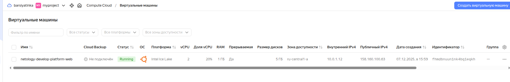   

Залогинимся в машину и выполним curl ifconfig.me

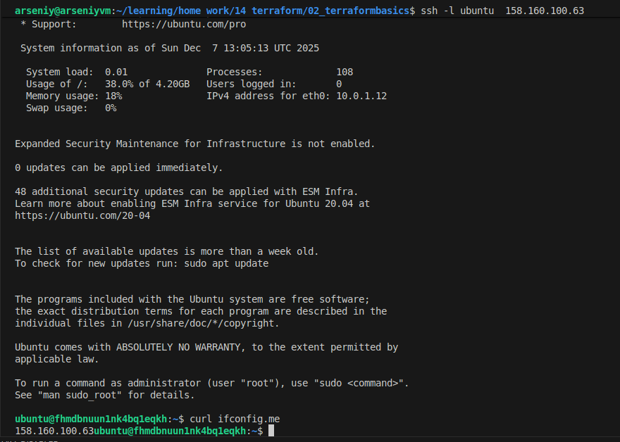   

Ошибки в файле:  
platform_id = "standart-v4" - правильно "standard-v4"
Так же в моем случае "standard-v4" не заработал и пришлось использовать "standard-v3", а в нём минимальные значения машин были:  
cores         = 2 колличество ядер на процессор.   
memory        = 1  колличество оперативной памяти в гигабайтах на одну машину.
core_fraction = 20  - % гарантированнай мощности на одно ядро.

1. **preemptible = true**  

Это включает “прерываемую” ВМ. Такие машины:
- Значительно дешевле обычных.
- Могут быть принудительно остановлены через 24 часа после запуска;

Как это помогает в обучении:
- Можно много раз поднимать/ломать инфраструктуру и сильно экономить деньги.
- Идеально для учебных стендов, лабораторок, CI, экспериментов — где не страшно, если ВМ внезапно упадёт.

2. **core_fraction = 5**  

сore_fraction — это базовый процент производительности CPU.  

5 означает: гарантировано только 5% CPU на ядро, но при наличии свободных ресурсов ВМ может “выстреливать” выше. 

Как это помогает в обучении:
Такая ВМ стоит ещё дешевле, чем с 20–100%.
Для ДЗ, где: ставишь пакеты, крутишь ssh / curl / nginx / простые сервисы —5% вполне хватает.  
Можно дёшево держать “живую песочницу” для Terraform.  

**Задание 2.**  

``` 
Замените все хардкод-значения для ресурсов yandex_compute_image и yandex_compute_instance на отдельные переменные. К названиям переменных ВМ добавьте в начало префикс vm_web_ . Пример: vm_web_name.
Объявите нужные переменные в файле variables.tf, обязательно указывайте тип переменной. Заполните их default прежними значениями из main.tf.
Проверьте terraform plan. Изменений быть не должно.

```
**Ответ**  
Перенесли все хардкод значения в переменные в [variables.tf](../variables.tf)  
Проверим конфигурацию. Изменений не произошло как и ыбло укзаано в задании.

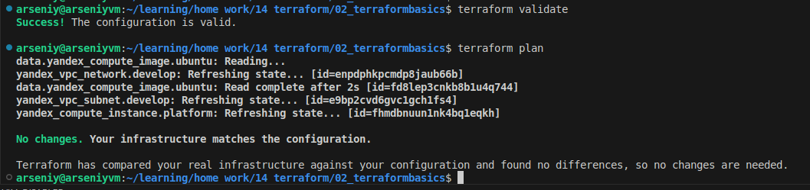   

**Задание 3.**  

``` 
Создайте в корне проекта файл 'vms_platform.tf' . Перенесите в него все переменные первой ВМ.
Скопируйте блок ресурса и создайте с его помощью вторую ВМ в файле main.tf: "netology-develop-platform-db" , cores  = 2, memory = 2, core_fraction = 20. Объявите её переменные с префиксом vm_db_ в том же файле ('vms_platform.tf'). ВМ должна работать в зоне "ru-central1-b"
Примените изменения.

```
**Ответ**  
Создадим в корне проекта [vms_platform.tf](../vms_platform.tf). Сделаем перенс в него всех переменных. Создадим вторую виртуальную машину [в main.tf](../main.tf).  
Проверим конфигурацию.  
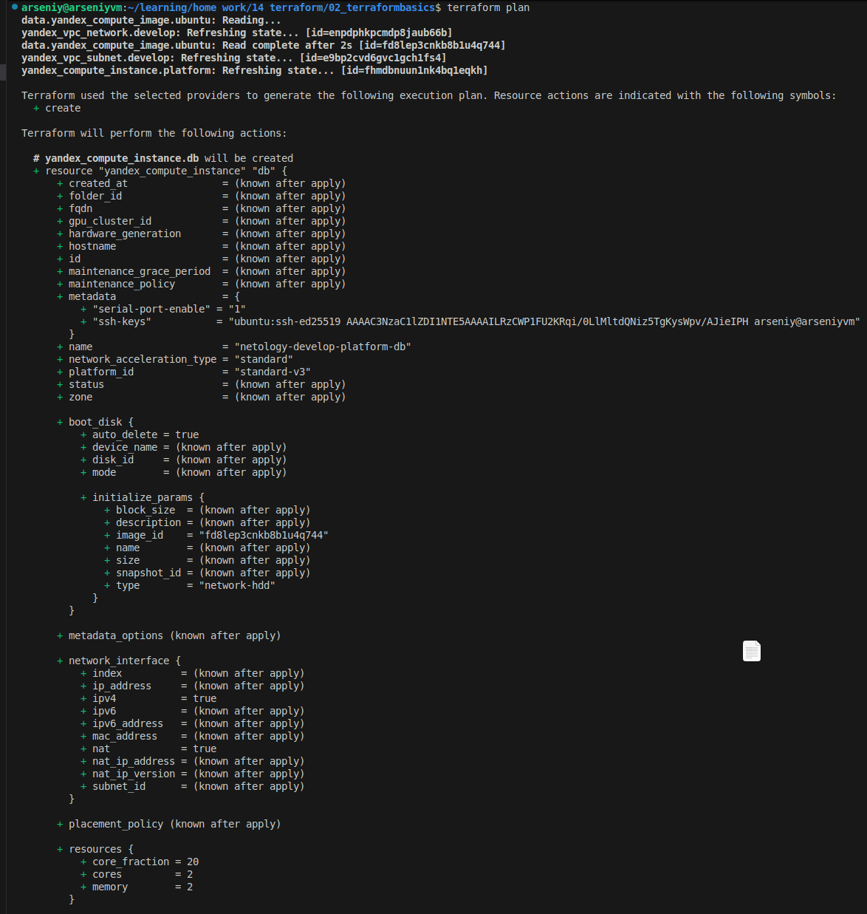    
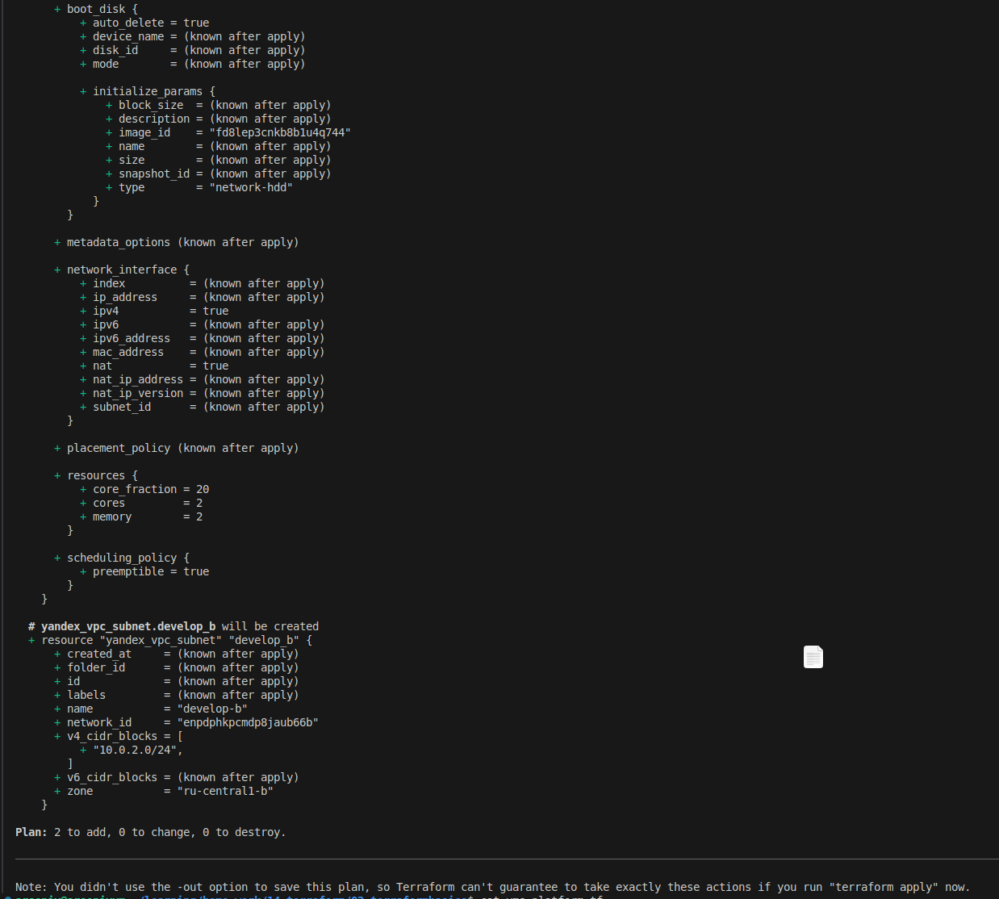  

**Задание 4.**  

``` 
Объявите в файле outputs.tf один output , содержащий: instance_name, external_ip, fqdn для каждой из ВМ в удобном лично для вас формате.(без хардкода!!!)
Примените изменения.
В качестве решения приложите вывод значений ip-адресов команды terraform output.

```
**Ответ**  
Создадим [Outputs.tf](../outputs.tf)
Запустим инстанс:  
   


**Задание 5.**  

``` 
В файле locals.tf опишите в одном local-блоке имя каждой ВМ, используйте интерполяцию ${..} с НЕСКОЛЬКИМИ переменными по примеру из лекции.
Замените переменные внутри ресурса ВМ на созданные вами local-переменные.
Примените изменения.

```
**Ответ**  
Создадим [locals.tf](../locals.tf) и опишем в нем имя для каждой ВМ.  
   

Так же внесем правки в main  

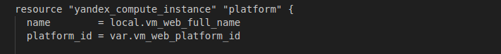   
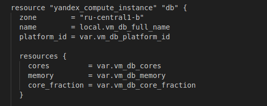   

 И провери конфигурацию:  

 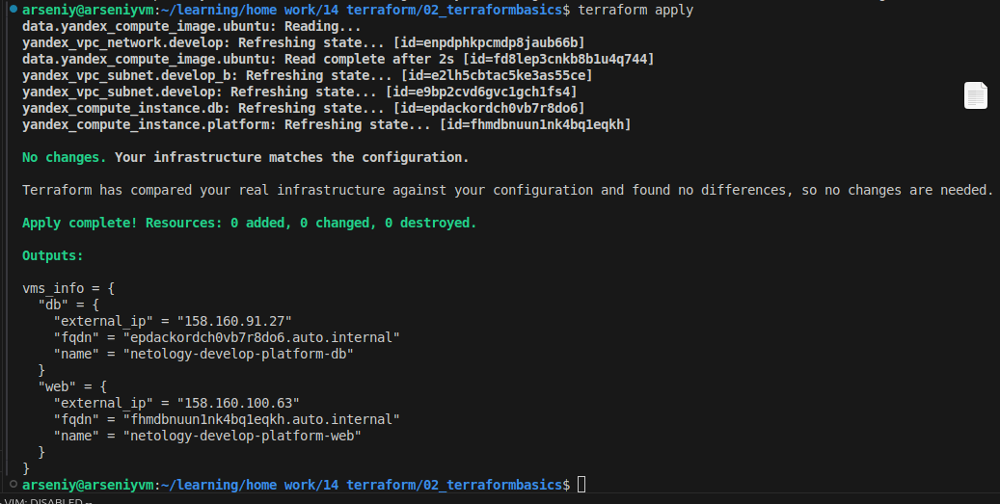  

**Задание 6.**  
```
6.1 Вместо использования трёх переменных ".._cores",".._memory",".._core_fraction" в блоке resources {...}, объедините их в единую map-переменную vms_resources и внутри неё конфиги обеих ВМ в виде вложенного map(object).

пример из terraform.tfvars:
vms_resources = {
  web={
    cores=2
    memory=2
    core_fraction=5
    hdd_size=10
    hdd_type="network-hdd"
    ...
  },
  db= {
    cores=2
    memory=4
    core_fraction=20
    hdd_size=10
    hdd_type="network-ssd"
    ...
  }
}
6.2 Создайте и используйте отдельную map(object) переменную для блока metadata, она должна быть общая для всех ваших ВМ.

пример из terraform.tfvars:
metadata = {
  serial-port-enable = 1
  ssh-keys           = "ubuntu:ssh-ed25519 AAAAC..."
}
6.3 Найдите и закоментируйте все, более не используемые переменные проекта.

6.4 Проверьте terraform plan. Изменений быть не должно.

```
**Ответ**  

Делаем map ресурсов:  

в vms_platform.tf:  
 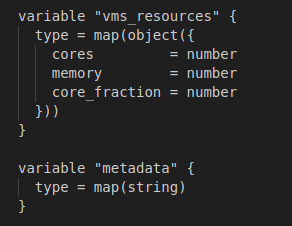   

в personal.auto.tfvars:  

 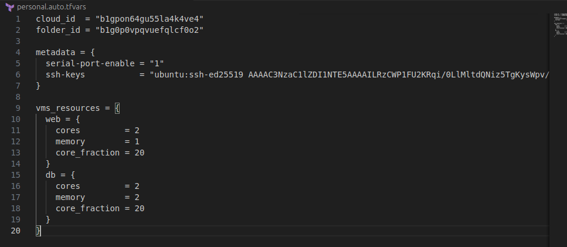   

 Комментируем ресурсы в [vms_platform.tf](../vms_platform.tf).  

 Используем vms_resources в main.tf:

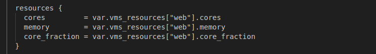   

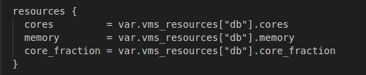   
 
 Подключаем metadata в обе ВМ: 

 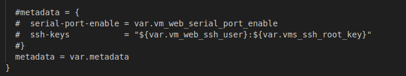 
 
 Всё корректно.
